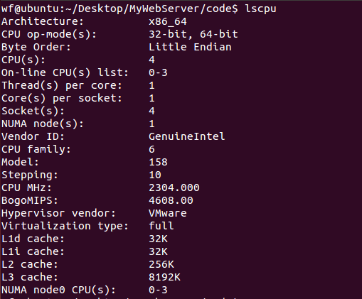
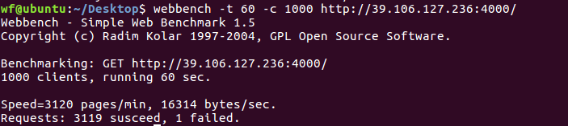
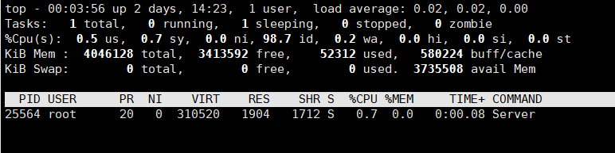
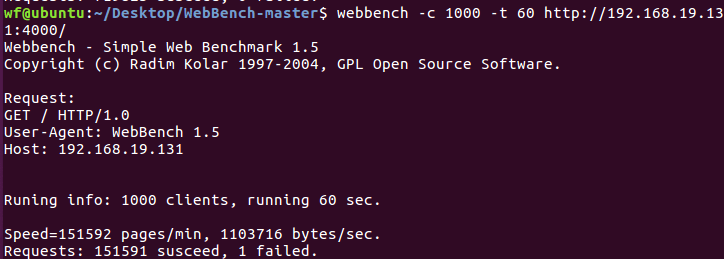
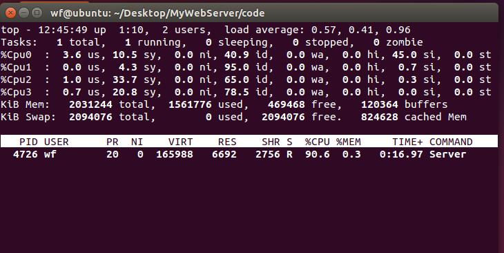
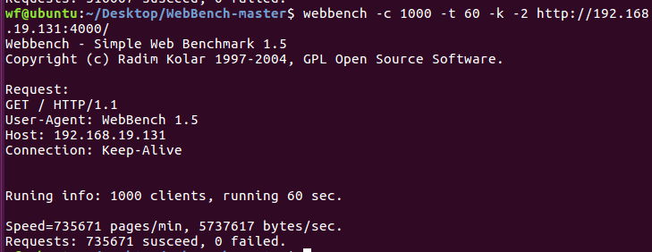
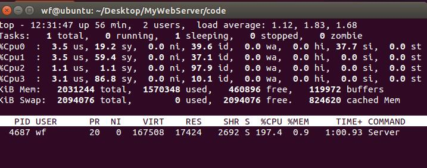
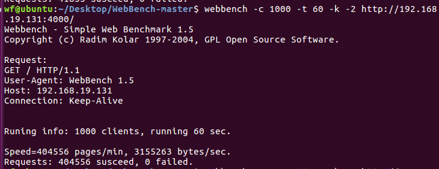
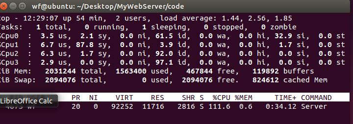
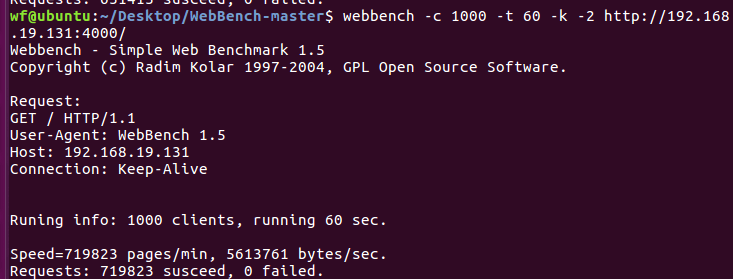

# 并发测试

## 1.测试内容

* 长连接与短连接的对比
* 长连接线程池中线程数目对结果的影响

## 2.测试环境

* 我开发和测试这个项目都用的是阿里云的学生免费服务器，其配置为2核CPU，4G内存，但是带宽只有1Mbps，导致文件传输速度严重拖累了服务器整体性能，只好选择自己一台电脑上开两台虚拟机进行测试

* 虚拟机配置如下:

  1.cpu: x86_64架构，4个单核CPU

​    	2.网络:中国电信100M带宽

## 3.测试条件:

* 使用workbench测试，测试时长60秒，并发数1000
* workbench本身不支持长连接，这里使用的是linyacool修改的支持长连接的[workbench]( https://github.com/linyacool/WebBench )

## 4.测试结果

### 阿里云服务器的测试:

* 测试参数:连接时长10秒,线程数4:	

* 测试结果：

  较好的一次结果:

* 资源使用情况:

​			**结论:由于阿里云服务器带宽的限制，文件下载速度只有10K，导致CPU资源无法充分利用**

### 虚拟机上的测试:

#### 1.长连接与短连接的对比

##### 	   短连接

* 测试参数: 连接时长5秒，2线程

* 测试结果:

  

* 资源使用情况:

  

##### 		长连接

* 测试参数:连接时长为10秒，2线程
* 测试结果:

* 资源使用情况:

**结论:长连接的情况下减少了TCP连接断开的次数，大幅提升了传输效率**

#### 2.长连接线程池中线程数目对结果的影响

**注:所有服务器参数均为超时时间5秒，所有客户端的连接时长均为30秒**

##### 线程池中线程数目为1

* 测试结果:

  

* 资源使用情况:

  

  

##### 线程池中线程数目为2

* 测试结果;

* 测试参数:

##### 线程池中线程数目为3

*  测试结果:

  
* 测试参数:

**结论:在4核CPU的情况下，随着线程池中线程的数目增加，程序的CPU使用率也随着增加。但是线程数目为3的情况下程序执行效率已经开始下降，原因是线程间切换的开销影响了服务器性能。因此4核CPU的服务器线程池中线程数目为2是最合适的。**

